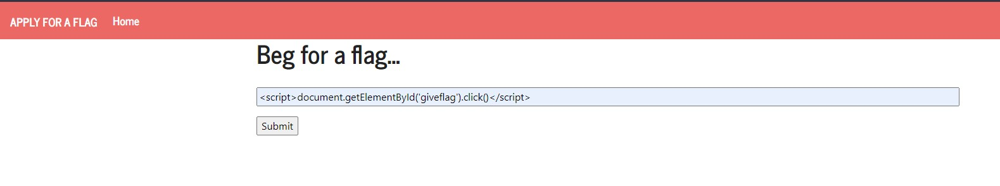
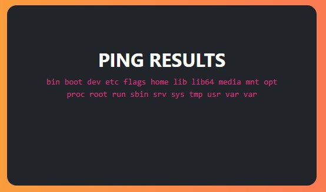
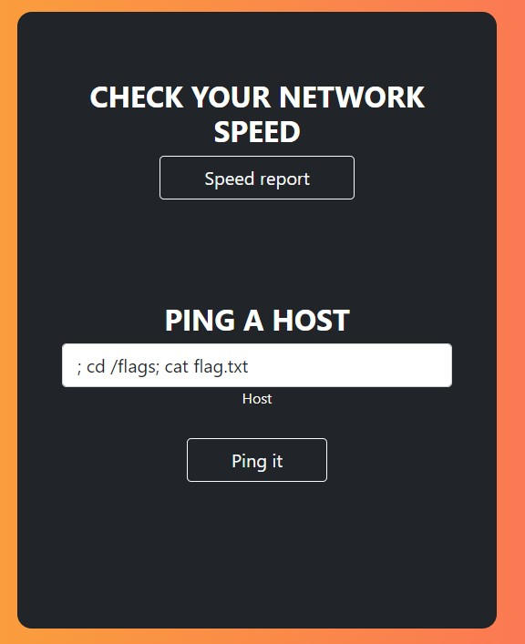
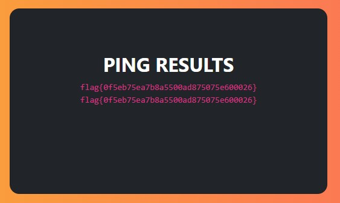

# FSI-CTFS: Week #10

## **First Challenge**

**Goal:** Perform an XSS attack to get the flag.

**Website analysis**

We are given a website containing a form with a text input. During analysis, we quickly discover this has an XSS vulnerability and therefore must be our attack vector.

>We then look into our request page:
- There is a script running every 5 seconds that refreshes the page and that is when the admin checks our request.
- There are 2 buttons that are disabled and therefore must be only available to the admin. The one we are interested in is the 'Give the flag'.


**Attack**

> Given that we have a XSS entry point, and that the page we that code is loaded is checked by the admin every 5 seconds, we can run arbitrary javascript code that will be executed by the admin to print our flag.

This can achieved by sending the following line through the text input:
```html
<script> document.getElementById('giveflag').click() </script>
```



>And then we obtain our flag!


## **Second Challenge**

**Goal:** Print the flag which is locate at /flags/flag.txt in the web server.

**Website analysis**

In the home page, we are prompted with a login form. We don't have an account, and our goal here is not to gain access to any acccounts. But, there is a link to another page, to check the network status.

In that page, we have a form with a text input where we are able to ping a host. We tested with 'google.com' to see the result:


- Hmmm... it prints out everything as if we were pinging from a terminal almost.

> Could we potencially send other commands for the server to run?

Let's try with the following input to see if works:

```bash
; ls
```


> It works! That means the text input isn't being sanitized.

We were told the flag was in /flags/flag.txt, but I looked for it anyways.
And it was in that folder indeed.




### **Attack**

Now, we only need to print the flag. We can achieve this with any of the following payloads.


```bash
; cat /flags/flag.txt
; cd /flags; cat flag.txt
```



> And obtained our second desired flag!


