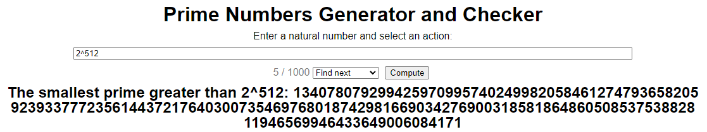
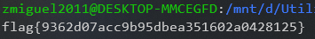
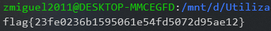

# FSI-CTFS: Week #12

## **First Challenge**

**Goal:** Decrypt the encrypted flag.

**Program analysis**

We are given a cypher that has been encripted with a RSA function. We know that the public *e* is 0x10001 and we are also told that *p* and *q* the next primes of 2**512 and 2**513, respectively.

>So, in order to 'crack' our flag, we need to:
- Find the values of *p* and *q*, so we can obtain **n** and **d**
- Calculate the value of **d** ---> a number such that d*e % ((p-1)*(q-1)) = 1
- And finally, decrypt the cypher with the given decrypt function.


**Attack**

### Finding the values of p and q

To find the next primes of a number x, we could write a function to perform that operation. Instead, we opted to look it up for an easier solution. This [website](https://www.numberempire.com/primenumbers.php) calculates the next prime number of the input we give.




> We can now calculate n which is p * q

### Calculating the value of d

In order to find the value of d, we need to solve this equation. Let's call (p-1)*(q-1) *phi* since it's the norm in **Extended Euclidean algorithm**.
```
"The extended Euclidean algorithm is essentially the Euclidean algorithm (for GCD's) ran backwards.

Your goal is to find d such that e*d ≡ 1 (mod φ(n))."
```

```
d is a number such that d*e % ((p-1)*(q-1)) = 1
<=> (d*e) % phi = 1 && phi = (p-1)*(q-1)
<=> d = pow(e, -1, phi)
```

As shown above, we'll use the python *pow* function to find d. Since we want to calculate the modular multiplicative inverse of d, we need to enter '-1' in the second parameter of the function call.

> Having obtained both n and d, we now only need to copy the cypher given in the program running in the CTF server and decrypt it using the given function.

Here is the exploit code:
```python
from binascii import hexlify, unhexlify

# NEXT PRIME NUMBERS FOUND WITH : https://www.numberempire.com/primenumbers.php
# p is the next prime 2**512
p = 13407807929942597099574024998205846127479365820592393377723561443721764030073546976801874298166903427690031858186486050853753882811946569946433649006084171
# q is the next prime 2**513
q = 26815615859885194199148049996411692254958731641184786755447122887443528060147093953603748596333806855380063716372972101707507765623893139892867298012168351
n = p*q
e = 0x10001 # a constant
phi = (p-1)*(q-1)
d = pow(e, -1, phi) # a number such that d*e % ((p-1)*(q-1)) = 1 <=> (d*e) % phi = 1 <=> d = pow(e, -1, phi)


def enc(x):
	int_x = int.from_bytes(x, "big")
	y = pow(int_x,e,n)
	return hexlify(y.to_bytes(256, 'big'))

def dec(y):
	int_y = int.from_bytes(unhexlify(y), "big")
	x = pow(int_y,d,n)
	return x.to_bytes(256, 'big')


enc_flag = "00000000000000000000000000000000000000000000000000000000000000000000000000000000000000000000000000000000000000000000000000000000000000000000000000000000000000000000000000000000000000000000000000000000000000000000000000000000000000000000000000000000000000005690a19b799c6ee52e7f58d29932c944f01678e318759433faf93eec577787fad1e30fbd0318ff9894487d20be89d12773098fff59f3253dfed4b28cd7912da01eee9a04086776f6c246ad38a5520ccc2edb01112b378f8e8c0bfe0a84103c67de4293d384b693b65529132ffd2eac32a81183561a9b57f5a33d6587100814f9"
y = dec(enc_flag)
print(y.decode())
```
>And then we obtain our flag!



## **Second Challenge**

**Goal:** Decrypt the encrypted cyphers sent in the CTF server (containing our flag).

**Program analysis**

We are given encrypted cyphers corresponding to our flag. This time we have 2 different *e* values, *e1* = 0x10001 and *e2* = 0x10003 and we are also told the value of **n** (which is 517 chars long).

**Math Background**

Recall that RSA encryption is performed as follows:


Also, Bezout’s Theorem states that, if there are integers a and b, which are not both zero, then there are integers x and y such that:


xa + ya = gcd(a, b)


### **Attack**

Back in our context, if gcd(*e1*, *e2*)=1, then we have integers x and y such that:


x*e1* + y*e2* = 1

Now, by using the **Extended Euclidean algorithm** we can find x and y and then is easy to show that the plaintext can be recovered as shown below:


So, in order to break the RSA encryption and the retrieve our flag, all we need to calculate is:


Now, we need to write all of this into a python script.

```python
from math import gcd
from binascii import hexlify, unhexlify

n = 29802384007335836114060790946940172263849688074203847205679161119246740969024691447256543750864846273960708438254311566283952628484424015493681621963467820718118574987867439608763479491101507201581057223558989005313208698460317488564288291082719699829753178633499407801126495589784600255076069467634364857018709745459288982060955372620312140134052685549203294828798700414465539743217609556452039466944664983781342587551185679334642222972770876019643835909446132146455764152958176465019970075319062952372134839912555603753959250424342115581031979523075376134933803222122260987279941806379954414425556495125737356327411
e1 = 0x10001 # a constant
e2 = 0x10003 # a constant
c1 = int.from_bytes(unhexlify("5bbd16fd4bc0a6a7ef56b2497b2d6d155e376cbd2007c224fded3065fb0642547020731c6ec0bdf05d3ae80d0192cdd1b9900ee1a2be60ddf372edbe12cc3085f8c3c100857bd12017a6ae0c3fed960e993a92f7aac493e7d0abbfd773d0376d20793bef72854bec4cb3339134762769f838f79db3f07250849be1a2ca1bd1be951dbc9b69c52b51bc66d0b62cc349265a23b8b67882db284f41a58a9a16d625f3b1fc8f8feee5f932c39d1dea8b4230fbe11b83e63f4321c88974fb184aa58002dce4c2b895e54857ccb481b4ed36ad35778081bd5f614fb0226115744b1bc0000109c339cb6bfc753252ec01c47ec010c9849e74ecde919162d9cda992e904"), "big")
c2 = int.from_bytes(unhexlify("e180cf80164a8e5917e8bff6daf1b41fd6ab4364bc71b7bd9ac775b43f131574bda6506a2edf758672a7754fe58b985327fe53d437641c538829c0f239c54d6c8daea9901cf65635c3cdab3eb0a53c90fe691915ac5e8f001cca765edd3becd9923a6dcf9d452a4379a03b3e4bb42fc316bdc1eae1990c9845fd53743461071ce848c4ed99d4b766ac4178f04b727d28c1440382fccaae529f387919cb4a49ce69bae63bd15c937da2a500191c476d761acc4764038a39e35e24772269071c8ba24dc351295c568148d9216a4a6a230398a0554ea39caf204edd013930d9b37166305a29b3ddc2381d5257a8599ab96ec1f8206d6a28ea346d343a85d54ae38f"), "big")


s1 = pow(e1, -1, e2)
s2 = int((gcd(e1,e2) - e1 * s1) / e2)
temp = pow(c2, -1, n)
m1 = pow(c1,s1,n)
m2 = pow(temp,-s2,n)
flag = ((m1 * m2) % n).to_bytes(256, 'big')
print(flag.decode())
```


> And obtained our second desired flag!


